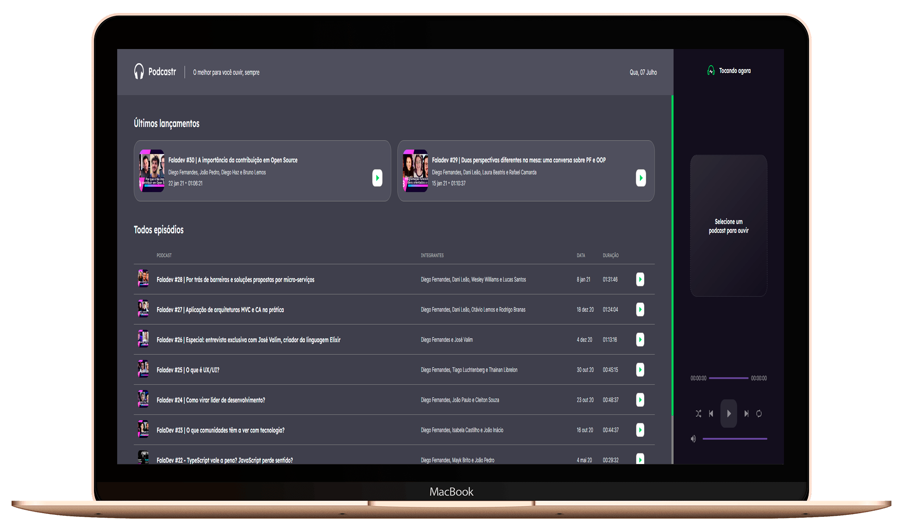

<h1 align="center">
    
</h1>

<h4 align="center">
  O melhor para você ouvir, sempre 🎧🎶
</h4>

<p align="center">
  

  
  
  <a href="https://github.com/thiagoperesbr/nlw-podcastr/commits/main">
    
  </a>

  
  
  <a href="https://www.linkedin.com/in/thiagoperes/">
    
  </a>
</p>

<p align="center">
  
</p>

## 💻 Projeto

Podcastr - é uma plataforma para transmissões de podcasts, te levando ainda mais perto dos melhores podcasts de tecnologia!

Projeto desenvolvido durante a NLW - Next Week Level oferecida pela [Rocketseat](https://rocketseat.com.br).
A NLW - Next Week Level é uma experiência online gratuita com muito conteúdo prático, onde o conteúdo fica disponível durante uma semana.

## 💻 Layout

O layout da aplicação está disponível no Figma:

<a href="https://www.figma.com/file/T0mzJosneEsV7AASCQRMEm/Podcastr-(Copy)?node-id=160%3A2761">
  
</a>

## 💻 Deploy

O deploy da aplicação está disponível no Vercel:

[](https://nlw-podcastr-xi.vercel.app/)

## 🚀 Tecnologias

Esse projeto foi desenvolvido com as seguintes tecnologias:

- [React](https://reactjs.org)
- [Next.js](https://nextjs.org/)
- [Typescript](https://www.typescriptlang.org/)
- [Sass](https://sass-lang.com/)

## 🚀 Instalação e execução

### Pré-requisitos

Antes de começar, você vai precisar ter instalado em sua máquina as seguintes ferramentas:
1. [Git](https://git-scm.com)
2. [Node.js](https://nodejs.org/en/)
3. [VSCode](https://code.visualstudio.com/)

### 🧭 Rodando a aplicação web (Front End)

```bash
# Clone este repositório
$ git clone https://github.com/thiagoperesbr/nlw-podcastr.git
# Acesse a pasta do projeto no seu terminal/cmd
$ cd nlw-podcastr
# Instale as dependências
$ npm install
# Execute a aplicação web
$ npm run start
# A aplicação será aberta na porta:3000 - acesse http://localhost:3000
```

## 😯 Como contribuir para o projeto

1. Faça um **fork** do projeto.
2. Crie uma nova branch com as suas alterações: `git checkout -b my-feature`
3. Salve as alterações e crie uma mensagem de commit contando o que você fez: `git commit -m "feature: My new feature"`
4. Envie as suas alterações: `git push origin my-feature`
> Caso tenha alguma dúvida confira este [guia de como contribuir no GitHub](https://github.com/firstcontributions/first-contributions)


## :memo: Licença

Esse projeto está sob a licença MIT. Veja o arquivo [LICENSE](https://github.com/thiagoperesbr/nlw-podcastr/blob/main/LICENSE) para mais detalhes.

Feito por Thiago Mourão Peres 👋🏽 [Entre em contato!](https://www.linkedin.com/in/thiagoperes/)
